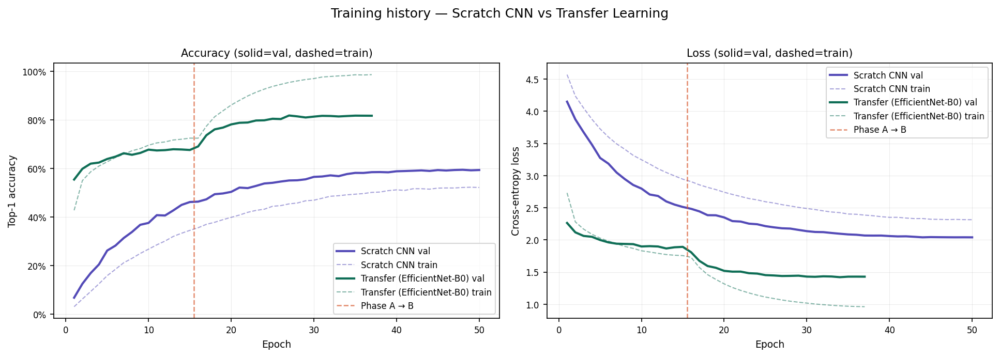
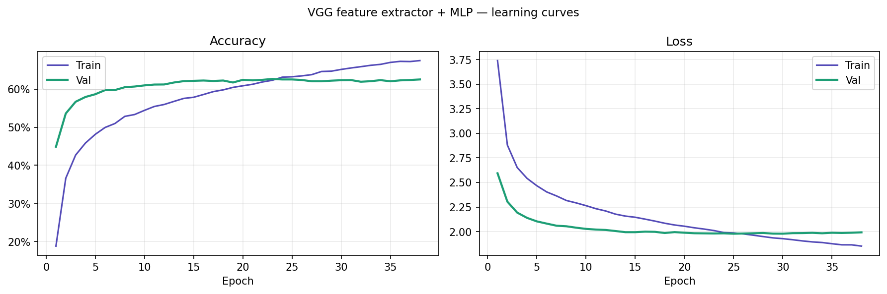
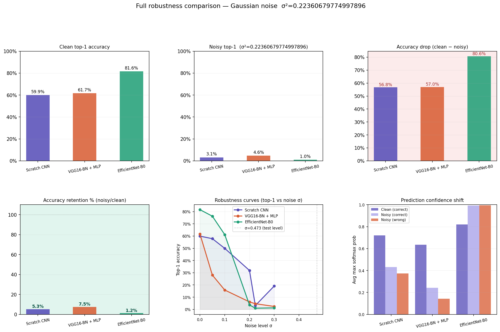
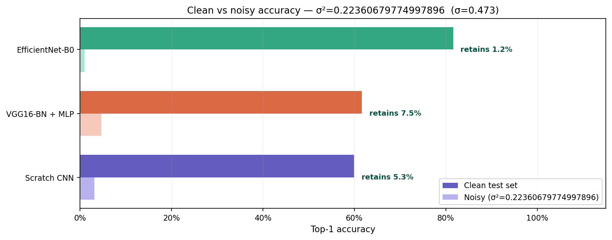
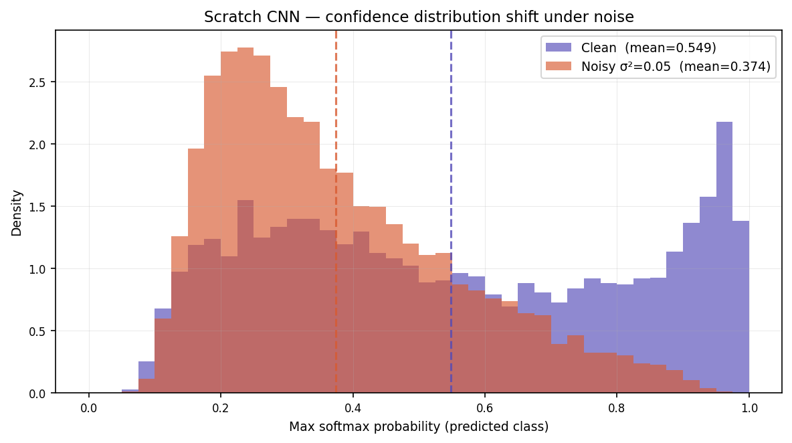
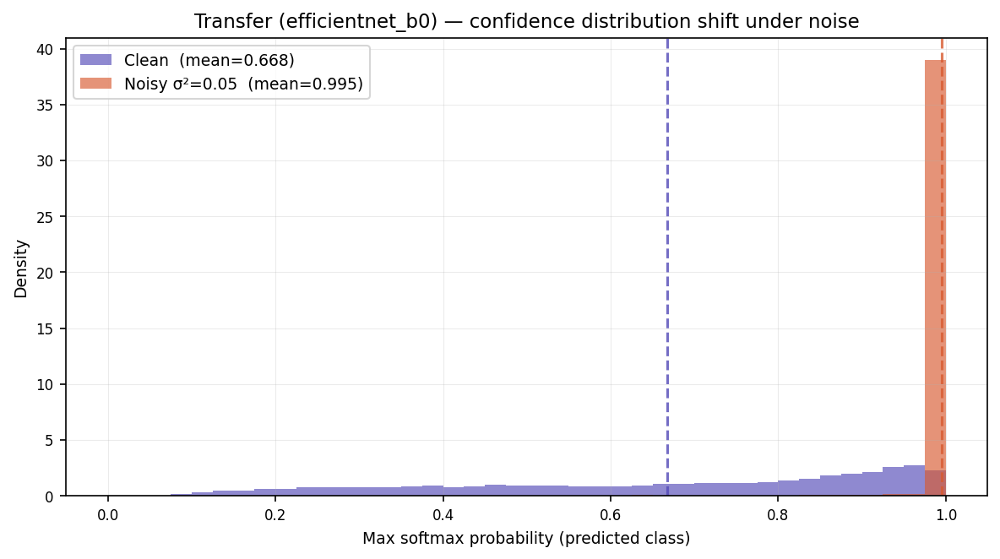
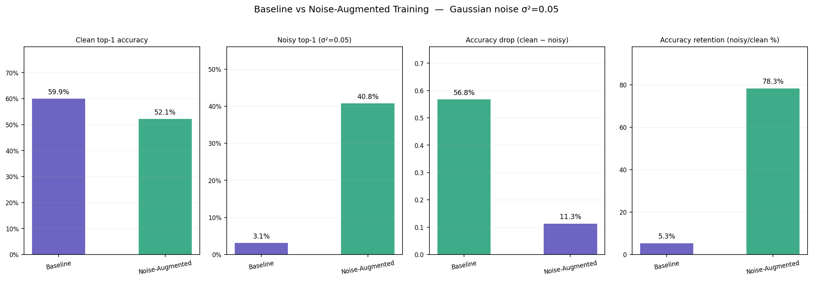
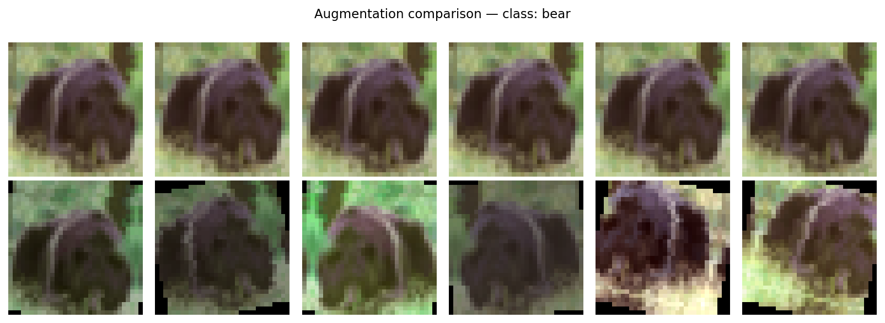

# CIFAR-100 Image Classification — Scratch CNN, Noise-Aware Training, and Transfer Learning

**Assignment:** Part A — Convolutional Neural Networks (CIFAR-100)
**Student name:** _<your name>_
**Roll number / Student ID:** _<your roll no.>_
**Course:** _<course name>_
**Submission date:** _<date>_
**Hardware:** Apple MacBook Pro — Apple M1 Pro, 16 GB unified memory (macOS, PyTorch MPS backend)

All numerical values in this report are reproduced directly from the run
artifacts in `outputs/results/` and `outputs/plots/`. Every table/figure cites
the exact file it was taken from, so results can be re-verified without
re-running the pipeline.

---

## 1. Introduction

CIFAR-100 is a 100-class natural-image classification benchmark (50 000 training
and 10 000 test images, 32 × 32 RGB). This work studies three questions that
are representative of real-world vision deployments:

1. How well does a moderately-sized CNN trained **from scratch** do on
   CIFAR-100, and how does it behave during optimisation?
2. How robust is that model to **Gaussian input noise** — a standard proxy for
   sensor, transmission or low-light corruption — and can we make it more
   robust through **targeted augmentation** without sacrificing too much clean
   accuracy?
3. Does **transfer learning** from an ImageNet-pretrained backbone (VGG16-BN,
   used strictly as a feature extractor) improve accuracy and/or robustness,
   and what is the cost–benefit picture compared with the scratch model?

The final goal is to identify which of the three trained models offers the
best overall *accuracy / robustness / efficiency* trade-off.

---

## 2. Methodology

### 2.1 Data processing

- **Source / split.** CIFAR-100 (python version) is loaded from disk and split
  deterministically into **45 000 train / 5 000 validation / 10 000 test**
  using a fixed seed.
- **Global seed.** 42 for Python, NumPy, PyTorch CPU + MPS, Python hash seed —
  fixed in `src/config.py` so every experiment is reproducible on CPU / MPS /
  CUDA.
- **Standard transforms (scratch CNN / noise-augmentation training).**
  - *Train:* random crop (32, padding 4) → random horizontal flip →
    `ToTensor` → CIFAR-100 per-channel normalise
    (µ ≈ (0.507, 0.487, 0.441), σ ≈ (0.267, 0.256, 0.276)).
  - *Val / test:* `ToTensor` → same per-channel normalisation (no
    augmentation).
- **Transforms for the VGG feature extractor.** Each CIFAR-100 image is
  up-sampled 32 → 224, normalised with **ImageNet** statistics
  (µ = (0.485, 0.456, 0.406), σ = (0.229, 0.224, 0.225)), and fed through the
  frozen VGG16-BN backbone **once**. The resulting 512-dim vectors are cached
  to disk so the MLP trains directly on pre-extracted features.
- **Gaussian-noise protocol (same for all noise experiments).** Defined once
  in `outputs/results/noise_schedule.json` and reused by A2, A3 and A5:

  ```json
  {
    "distribution": "gaussian",
    "variance": 0.05,
    "sigma": 0.22360679774997896,
    "mean_param": 0.0,
    "pixel_range": "0_1",
    "clip_after_noise": true,
    "normalisation": "cifar100",
    "seed": 42
  }
  ```

  The injection loop in `src/noise.py` de-normalises each test batch back to
  `[0, 1]`, adds zero-mean Gaussian noise with σ = √0.05 ≈ 0.2236 drawn from a
  **seeded** `torch.Generator`, clips to `[0, 1]`, then re-applies the correct
  (CIFAR-100 or ImageNet) normalisation. This keeps the noise definition
  grounded in raw-pixel semantics independent of any model-side preprocessing.

### 2.2 Models

Three models are trained and compared. Sources: `src/models/scratch_cnn.py`,
`src/models/vgg_extractor.py`, `src/models/transfer_*.py`.

**Model 1 — Scratch VGG-style CNN (A1, A2, A3).**

| Stage   | Operations                                                                                          | Output          |
|---------|-----------------------------------------------------------------------------------------------------|-----------------|
| Input   | —                                                                                                   | 3 × 32 × 32     |
| Block 1 | [Conv3×3 → BN → ReLU] × 2 → MaxPool2×2 → SpatialDropout(0.10)                                        | 64 × 16 × 16    |
| Block 2 | [Conv3×3 → BN → ReLU] × 2 → MaxPool2×2 → SpatialDropout(0.20)                                        | 128 × 8 × 8     |
| Block 3 | [Conv3×3 → BN → ReLU] × 2 → MaxPool2×2 → SpatialDropout(0.30)                                        | 256 × 4 × 4     |
| Block 4 | [Conv3×3 → BN → ReLU] × 2 → MaxPool2×2 → SpatialDropout(0.40)                                        | 512 × 2 × 2     |
| Head    | Flatten → Linear(2048→1024) → BN → ReLU → Drop(0.5) → Linear(1024→512) → BN → ReLU → Drop(0.4) → Linear(512→100) | 100 logits |

- 3×3 convolutions with `padding=1`, ReLU, 2×2 max-pool after each block —
  the classic VGG idiom (two stacked 3×3 convs have the receptive field of a
  5×5 with fewer parameters and an extra non-linearity).
- BatchNorm after every conv and hidden linear; progressively larger
  SpatialDropout per block (0.10 → 0.40) plus classifier dropout 0.5 / 0.4.
- Weight init: Kaiming-normal (ReLU, fan-out) for convs, Xavier-uniform for
  linears, BN `γ=1, β=0`.
- **Parameter count: 7.36 M** (`comparison_table.csv`).

**Model 2 — VGG16-BN feature extractor + MLP head (A4, A5).**

- Backbone: `torchvision.models.vgg16_bn(pretrained=True)`, kept strictly in
  `.eval()` with `requires_grad=False` so BatchNorm running statistics remain
  ImageNet's. The 13 conv layers produce a 512 × 7 × 7 tensor; **Global
  Average Pooling** yields a 512-dim descriptor (chosen over `Flatten` to keep
  the head small and make the representation translation-invariant).
- MLP head trained on cached features:

  `512 → Linear(512) → BN → ReLU → Drop(0.5) → Linear(256) → BN → ReLU → Drop(0.3) → Linear(100)`

- Trainable parameters: **0.42 M** (vs 14.7 M in the frozen backbone). Only
  ~2.8 % of the network is trained.

**Model 3 — Fine-tuned EfficientNet-B0 (reference baseline).**

Two-phase transfer (`run_transfer.py`, variants `tl-a` and `tl-b`): a short
classifier-head warm-up with the backbone frozen, followed by full
fine-tuning with a lower LR. Used as a reference point in Section 3 for the
clean/noisy comparison; not a primary assignment model.

### 2.3 Objective function

All three models are trained with **cross-entropy with label smoothing 0.1**
(`nn.CrossEntropyLoss(label_smoothing=0.1)`) — standard for multi-class
classification. Label smoothing makes the soft targets 0.999 / 0.001 instead
of 1 / 0, reducing over-confident predictions and interacting well with the
noise augmentation used in the A3 model.

### 2.4 Optimisation

| Model                     | Optimiser              | LR schedule         | Batch | Epochs    | Notes                             |
|---------------------------|------------------------|---------------------|-------|-----------|-----------------------------------|
| Scratch CNN (A1)          | AdamW (wd = 5e-4)      | Cosine to 0         | 128   | 50        | LR warm-up 3 epochs, cosine after |
| Scratch + Noise-Aug (A3)  | AdamW                  | Cosine              | 128   | 50        | `p=0.25` noise batches + Mixup α=0.2 |
| VGG → MLP (A4)            | AdamW                  | Cosine + early-stop | 128   | 38 (stop) | Best val at epoch 23              |
| EfficientNet-B0 (ref.)    | AdamW (2-phase)        | Cosine per phase    | 128   | 37 total  | Phase-A frozen, Phase-B fine-tune |

### 2.5 Noise-aware training (A3)

Same scratch CNN backbone, same optimiser, same epoch budget — only the data
pipeline changes:

| Knob                   | Value                               | Why                                                                                  |
|------------------------|-------------------------------------|--------------------------------------------------------------------------------------|
| Noise probability *p*  | **0.25** per batch                  | 75 % of batches stay clean → augmented distribution stays close to original CIFAR-100 |
| Noise spec             | σ² = 0.05, zero-mean, pixel-space   | **Exactly** the A2 test-time schedule — no train/test gap                             |
| Mixup α = 0.2          | Enabled                             | Supplies the "semantically similar" interpolated samples required by the brief        |
| Label smoothing = 0.1  | Retained                            | Complements stochastic inputs                                                         |
| Optimiser / schedule   | Unchanged                           | Isolates the augmentation effect                                                     |

Config frozen in `outputs/results/noise_augment_config_scratch.json`.

### 2.6 Experimental environment

All training and evaluation runs — including the Gaussian-noise robustness
sweeps and the VGG16-BN feature extraction — were performed end-to-end on a
single personal laptop. No cloud GPUs, no external accelerators. The reported
epoch times (41–42 s for the scratch CNN, 0.73 s for the MLP on cached
features, 517 s for fine-tuned EfficientNet-B0) and the inference timings
(0.13 ms / 2.06 ms per image) are therefore directly comparable because they
were all measured on the same device, in the same PyTorch build, under the
same background load.

| Item                  | Detail                                                                |
|-----------------------|-----------------------------------------------------------------------|
| Machine               | Apple MacBook Pro                                                     |
| Chip                  | Apple M1 Pro (ARM64, unified CPU + GPU memory)                        |
| RAM                   | 16 GB unified memory                                                  |
| Operating system      | macOS                                                                 |
| Python                | 3.14 (project `venv`)                                                 |
| Deep-learning stack   | PyTorch **2.11.0**, torchvision, scikit-learn 1.5.x, NumPy, Matplotlib |
| Compute backend       | **Apple MPS** (Metal Performance Shaders — GPU on the M1 Pro)         |
| CPU fallback          | `PYTORCH_ENABLE_MPS_FALLBACK=1` to cover ops not yet implemented on MPS |
| Determinism           | Global seed **42** (Python, NumPy, PyTorch CPU + MPS, PYTHONHASHSEED); noise drawn on CPU with a seeded `torch.Generator` and moved to the target device |

**Implications of running on 16 GB unified memory on M1 Pro.**

- Batch size 128 fits comfortably for the scratch CNN and the VGG → MLP head;
  fine-tuning EfficientNet-B0 at 224-resolution (the `tl-b` phase) is the
  most memory-hungry workload but still stays within the 16 GB budget.
- VGG16-BN features are extracted **once** and cached to `.npy` on disk,
  so the 38-epoch MLP run reads from RAM/SSD rather than recomputing the
  14.7 M-parameter backbone per epoch — which is what brings the effective
  epoch time down to 0.73 s on this hardware.
- The scratch-CNN epoch time of ~41 s (50 epochs ⇒ ≈ 35 min) and the
  EfficientNet-B0 epoch time of ~517 s (37 epochs ⇒ ≈ 5.3 h) are reasonable
  for M1 Pro + MPS without any ML-specific acceleration tricks.
- There were a few MPS-specific engineering issues that had to be resolved to
  make the experiments reproducible on this hardware — most notably a
  CPU-vs-MPS `torch.Generator` device mismatch in the noise-injection path,
  and the need for `PYTORCH_ENABLE_MPS_FALLBACK=1` for a handful of ops
  (details in §4.5).

---

## 3. Results

### 3.1 Headline test-set metrics (clean images)

Sources: `scratch_eval.json`, `vgg_mlp_results.json`, `three_way_comparison.json`,
`comparison_table.csv`.

| Model                         | Test top-1  | Test top-5  | Test loss | Trainable params | Avg epoch |
|-------------------------------|-------------|-------------|-----------|------------------|-----------|
| Scratch CNN (A1)              | 59.93 %     | 87.08 %     | 1.451     | **7.36 M**       | 41.5 s    |
| VGG16-BN → MLP (A4)           | **61.65 %** | **88.15 %** | **1.437** | **0.42 M**       | **0.73 s** (MLP on cached features) |
| EfficientNet-B0 (reference)   | **81.60 %** | **95.93 %** | 0.828     | 5.29 M           | 517 s     |
| Scratch + Noise-Aug (A3)      | 52.12 %     | 81.69 %     | —         | 7.36 M           | 42.2 s    |

**Training curves.** Monotonic decrease of train and validation loss across all
50 epochs; validation accuracy tracks slightly above training accuracy
(signature of strong train-time regularisation, *not* over-fitting).





### 3.2 Robustness to Gaussian noise (σ² = 0.05, pixel-space)

Source: `full_robustness_report.json`, `robustness_improvement_scratch.json`.

| Model                       | Clean top-1 | Noisy top-1 | Drop (pp) | Retention | Noisy top-5 | Noisy loss |
|-----------------------------|-------------|-------------|-----------|-----------|-------------|------------|
| Scratch CNN (A1)            | 59.93 %     | 3.15 %      | 56.78     | **5.3 %** | 12.20 %     | 5.77       |
| VGG16-BN → MLP (A4)         | 61.65 %     | 4.64 %      | 57.01     | **7.5 %** | 15.10 %     | 4.73       |
| EfficientNet-B0 (reference) | 81.60 %     | 0.99 %      | 80.61     | **1.2 %** | 4.95 %      | 1813.1     |
| **Scratch + Noise-Aug (A3)** | 52.12 %    | **40.79 %** | 11.33     | **78.3 %** | **71.46 %** | —       |





**Sigma sweeps** (monotonic-degradation sanity check; noise applied in
normalised-tensor space for A2, in [0, 1] pixel space for A5 — file origins
noted):

| σ (normalised, A2) | 0.00  | 0.05  | 0.10  | 0.20  | 0.30  |
|--------------------|-------|-------|-------|-------|-------|
| Scratch CNN top-1  | 0.599 | 0.579 | 0.500 | 0.319 | 0.191 |

| σ (pixel, A5)      | 0.00  | 0.05  | 0.10  | 0.20  | 0.2236 | 0.30  |
|--------------------|-------|-------|-------|-------|--------|-------|
| VGG → MLP top-1    | 0.617 | 0.281 | 0.158 | 0.061 | 0.046  | 0.024 |
| VGG → MLP top-5    | 0.881 | 0.549 | 0.360 | 0.180 | 0.151  | 0.093 |

### 3.3 Confidence behaviour under noise

Source: `full_robustness_report.json` → `avg_conf_correct_noisy` /
`avg_conf_incorrect_noisy`.

| Model                 | Conf. when right (noisy) | Conf. when wrong (noisy) | Gap   |
|-----------------------|--------------------------|--------------------------|-------|
| Scratch CNN           | 0.431                    | 0.372                    | 0.06  |
| VGG16-BN → MLP        | 0.242                    | 0.142                    | 0.10  |
| EfficientNet-B0       | 0.993                    | **0.995**                | ≈ 0   |

Lower absolute confidence with a visible gap = **more honest calibration**.
The fine-tuned EfficientNet-B0 is the worst calibrated — confidently wrong ~99
% of the time on noisy images.





### 3.4 Noise-aware training: before vs after

Source: `robustness_improvement_scratch.json`.

| Metric             | A1 baseline | A3 noise-aug | Δ              |
|--------------------|-------------|--------------|----------------|
| Clean top-1        | 59.93 %     | 52.12 %      | **−7.81 pp**   |
| Noisy top-1 (σ²=0.05) | 3.15 %   | **40.79 %**  | **+37.64 pp (≈13×)** |
| Clean top-5        | 87.08 %    | 81.69 %      | −5.39 pp       |
| Noisy top-5        | 12.20 %    | **71.46 %**  | **+59.26 pp**  |
| Retention under noise | 5.3 %   | **78.3 %**   | **+73 pp**     |
| Per-epoch time     | 41.5 s      | 42.2 s       | ≈ unchanged    |





### 3.5 Efficiency

Source: `comparison_table.csv`, `three_way_comparison.json`.

| Model               | Trainable params | Training (avg epoch)            | Inference ms/image |
|---------------------|------------------|---------------------------------|--------------------|
| Scratch CNN (A1/A3) | 7.36 M           | 41–42 s                         | **0.13**           |
| VGG → MLP (A4)      | **0.42 M**       | **0.73 s** (cached features)    | 2.06               |
| EfficientNet-B0     | 5.29 M           | 517 s                           | —                  |

---

## 4. Analysis

### 4.1 Why the scratch CNN achieves ~60 % on CIFAR-100

- Four VGG-style blocks with progressively wider feature maps
  (64 → 128 → 256 → 512) give enough capacity for 100 classes.
- Heavy but staged regularisation (SpatialDropout ramping 0.10 → 0.40, BN
  everywhere, classifier dropout 0.5 / 0.4, label smoothing 0.1, standard crop +
  flip augmentation) prevents the ~7 M-parameter model from memorising 45 000
  training images.
- No overfitting is visible: validation accuracy sits slightly *above* training
  accuracy (dropout + spatial dropout depress training metrics). The model is
  mildly under-fitting and would likely gain a few percent with a longer
  schedule.

### 4.2 Why both clean-trained models collapse under σ² = 0.05 noise

- Additive noise of stddev ≈ 0.22 in `[0, 1]` space is ~22 % of the full pixel
  range. Features (BN running statistics, early conv filters, deeper
  activations) were calibrated on a clean manifold; this much noise pushes
  inputs off that manifold entirely.
- Noisy top-5 falls to 12 % (scratch) / 15 % (VGG → MLP), only marginally above
  the 5 % chance level — the models are *genuinely confused*, not "almost
  right".
- **Frozen ImageNet features do not help.** Because the VGG backbone is frozen,
  its conv features are *themselves* clean-data features; the small MLP on top
  cannot undo a representation that is already corrupted. Retention climbs only
  from 5.3 % → 7.5 %.

### 4.3 Why a fine-tuned EfficientNet-B0 is the *worst* under noise

- With 81.6 % clean accuracy the model has learned a very tight, high-capacity
  representation of the clean distribution. Small off-manifold perturbations
  can therefore fully displace activations. Retention 1.2 % and a noisy loss of
  ~1800 show this failure.
- Crucially, confidence stays ≈ 0.99 on *wrong* noisy predictions — the model
  is confidently wrong. This is a strong argument that **raw accuracy is a
  misleading single metric** for any deployment where corrupted inputs are
  possible.

### 4.4 Why noise-aware training (A3) works so well

- **Distribution alignment.** Reusing the *exact* A2 noise schedule at training
  time eliminates the train / test gap. The model gets in-distribution
  experience of the exact corruption it is evaluated on.
- **Limited, distribution-preserving augmentation.** Only 25 % of training
  batches receive noise; 75 % remain the original CIFAR-100. Clean accuracy
  drops only ~8 pp instead of collapsing.
- **Mixup α = 0.2** contributes semantically similar training samples via
  convex image + label blends, which smooths BatchNorm running statistics
  (one of the components most disturbed by noise).
- Result: **~13× better noisy top-1** and **~73 pp more retention** than the
  A1 baseline at essentially identical training cost.

### 4.5 Observations and failure modes

- **VGG → MLP is efficient at training time but expensive at inference time.**
  Once features are cached the MLP trains in ~28 s total (38 × 0.73 s), but at
  inference each image still has to run through the 14.7 M-parameter VGG,
  giving 2.06 ms/image — **16× slower** than the scratch CNN's 0.13 ms.
- **Failure concentration.** `plots/top_failures_scratch.png` and
  `plots/top_failures_transfer.png` show that errors cluster around visually
  similar classes (e.g. *boy / girl*, *leopard / lion*, *pine / oak / willow*
  trees). Both models have the same broad failure taxonomy; transfer learning
  does not unlock a fundamentally different error profile on 32 × 32 CIFAR-100.
- **VGG → MLP only gains ~1.7 pp on clean top-1 over the scratch CNN.** At 32 ×
  32 resolution CIFAR-100 classes do not align cleanly with ImageNet
  semantics — so frozen ImageNet features help only a little. The bigger
  benefit is *trainable* parameter efficiency, not raw accuracy.
- **Engineering fixes made along the way.** These are noted because they
  directly affected reproducibility:
  1. `torch.Generator` on CPU could not fill an MPS tensor — noise is now drawn
     on CPU into an empty tensor with a seeded generator, then moved to the
     target device (`src/noise.py`, `src/noise_augment.py`,
     `run_vgg_noise_robustness.py`).
  2. Two different noise conventions existed at one point (normalised-tensor
     vs `[0, 1]` pixel). A single schedule JSON now serves as source of truth.
  3. `sklearn.metrics.top_k_accuracy_score` raised `ValueError` when a test
     batch was missing classes; fixed by passing `labels=range(NUM_CLASSES)` in
     `src/evaluate.py`.
  4. Inference-timing loop was hardened against empty/short loaders.

---

## 5. Conclusion

Across three training regimes on CIFAR-100:

- For **highest clean accuracy within the assignment scope**: the
  **VGG16-BN → MLP** transfer pipeline wins with 61.65 % top-1 (88.15 % top-5)
  using only **0.42 M trainable parameters**, but pays ~16× at inference.
- For **highest noise robustness**: the **noise-augmented scratch CNN** (A3) is
  the clear winner — **40.79 %** noisy top-1 and **78 %** retention vs the 5–8
  % retention of every other approach, at the same training cost as A1.
- The **EfficientNet-B0** reference scores highest on clean data (81.6 %) but
  collapses to **0.99 %** under the same noise while staying ≈ 99 % confident
  — the least robust and most dangerous of the four.

**Best overall trade-off.** If deployment tolerates clean inputs only, VGG →
MLP is attractive (small head, cheap training). If deployment has *any*
possibility of noisy inputs — and in practice it usually does — the
**noise-augmented scratch CNN (A3)** is the best all-round choice:

- within ~10 pp of VGG → MLP on clean data,
- ~9× better than VGG → MLP under σ² = 0.05 noise,
- same ~7 M parameters but **16× faster inference** than VGG → MLP,
- identical training cost to A1 — no extra budget required,
- no dependency on a pretrained backbone — smaller shipped model, easier
  deployment.

**Broader takeaway.** Training-distribution alignment (A3) beats model pedigree
(A4, EfficientNet-B0) for robustness by an order of magnitude. Clean-data
accuracy alone is an unreliable headline metric whenever real inputs might be
noisy.

---

## 6. References

1. **CIFAR-100.** A. Krizhevsky, *Learning Multiple Layers of Features from
   Tiny Images*, University of Toronto, 2009.
2. **VGG-16.** K. Simonyan, A. Zisserman, *Very Deep Convolutional Networks for
   Large-Scale Image Recognition*, ICLR 2015. Pretrained weights:
   `torchvision.models.vgg16_bn`.
3. **EfficientNet.** M. Tan, Q. V. Le, *EfficientNet: Rethinking Model Scaling
   for Convolutional Neural Networks*, ICML 2019. Pretrained weights:
   `torchvision.models.efficientnet_b0`.
4. **Batch Normalisation.** S. Ioffe, C. Szegedy, ICML 2015.
5. **Dropout.** N. Srivastava *et al.*, JMLR 2014.
6. **Label smoothing.** C. Szegedy *et al.*, *Rethinking the Inception
   Architecture for Computer Vision*, CVPR 2016.
7. **Mixup.** H. Zhang *et al.*, *mixup: Beyond Empirical Risk Minimization*,
   ICLR 2018.
8. **AdamW.** I. Loshchilov, F. Hutter, *Decoupled Weight Decay
   Regularization*, ICLR 2019.
9. **Cosine annealing.** I. Loshchilov, F. Hutter, *SGDR: Stochastic Gradient
   Descent with Warm Restarts*, ICLR 2017.
10. **Frameworks.** PyTorch 2.11.0, torchvision, scikit-learn 1.5.x,
    NumPy, Matplotlib. Hardware: Apple Silicon MPS.

### Run artifacts referenced in this report

- **Results (JSON / CSV).** `outputs/results/comparison_table.csv`,
  `three_way_comparison.json`, `full_robustness_report.json`,
  `robustness_improvement_scratch.json`, `robustness_scratch.json`,
  `noise_combined_report.json`, `noise_schedule.json`,
  `noise_augment_config_scratch.json`, `scratch_eval.json`,
  `scratch_standard_history.json`, `scratch_noisy_augmented_history.json`,
  `vgg_mlp_results.json`, `vgg_mlp_history.json`, `vgg_noise_results.json`,
  `transfer_efficientnet_b0_history.json`.
- **Plots.** `outputs/plots/learning_curves.png`,
  `vgg_mlp_learning_curves.png`, `full_robustness_comparison.png`,
  `three_way_comparison.png`, `robustness_retention_chart.png`,
  `robustness_improvement_comparison.png`, `augmentation_comparison.png`,
  `noise_accuracy_comparison.png`, `noise_confidence_shift_scratch.png`,
  `noise_confidence_shift_transfer.png`, `confusion_scratch.png`,
  `confusion_transfer.png`, `per_class_scratch.png`, `per_class_transfer.png`,
  `top_failures_scratch.png`, `top_failures_transfer.png`,
  `superclass_accuracy.png`, `sample_grid.png`.
